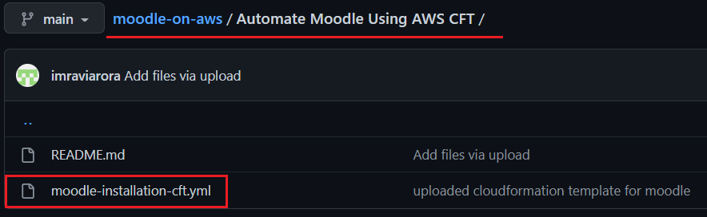

Setup Moodle Instance in AWS Using CloudFormation Template
=========


## About Moodle

Moodle is a learning platform designed to provide educators, administrators and learners with a single robust, secure and integrated system to create personalised learning environments.

Prerequisites:
```
Recommended hardware requirements (2 CPU, 2 GB Memory, 5GB Storage)
LAMP
Moodle Package
```

## Steps to set up moodle
-------------------------
1. Log into AWS Account and Make sure you're in N.Virginia Region

2. Search for CloudFormation service and select it

3. Click on Stacks section in the left plane 
4. Click on Create Stack button 
5. Upload CFT Template [moodle-installation-cft.yml](https://github.com/imraviarora/moodle-on-aws/blob/main/Automate%20Moodle%20Using%20AWS%20CFT/moodle-installation-cft.yml) and Click on Next button    
6. Enter stack name and select parameters or leave it default 
7. No need to change anything, leave everything default and Click on Next button  
8. Review Moodle CFT Stack and Click on Create Stack button   
9. Refresh section to check more Events   
10. After Stack complete successfully, check Output Section to get Moodle Access URL. 
11. Wait for atleast 5mins, before click on Moodle Access URL. 
12. Select Language and click on Next button 
13. Review storage paths and Click Next Button 
14. We're using MySQL on localhost, click on Next button 
15. Type Database configuration as shown in screenshot 
16. We need to create a config.php file on moodle instance 
17. Connect moodle instance using key pair used in parameters section. 
18. After config file creation, we can click on Next Button 
19. Accept T&C by clicking on continue button 
20. Our server have all mimimum php packages inorder to run moodle 
21. Scroll this page and click on Continue button 
22. Set up user profile and login credentials, click on Update Profile 
23. Set up Site 
24. This is Moodle Admin Panel 
25. Click on Profile button and Logout 
26. Use HTTPS instead of HTTP  
27. Configured local cert and key 
 
## Steps to Deletre Moodle environment
-------------------------
1. Go to AWS > CloudFormation > Stacks
2. Select Moodle Stack and Click on Delete button
 
